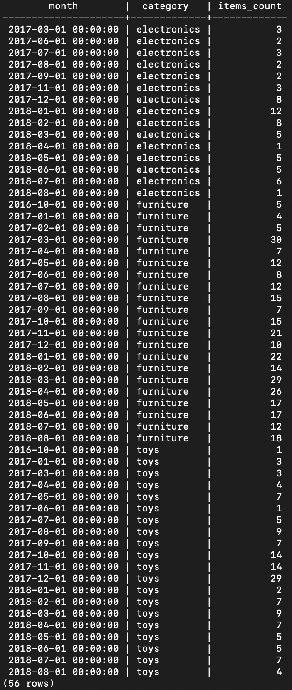
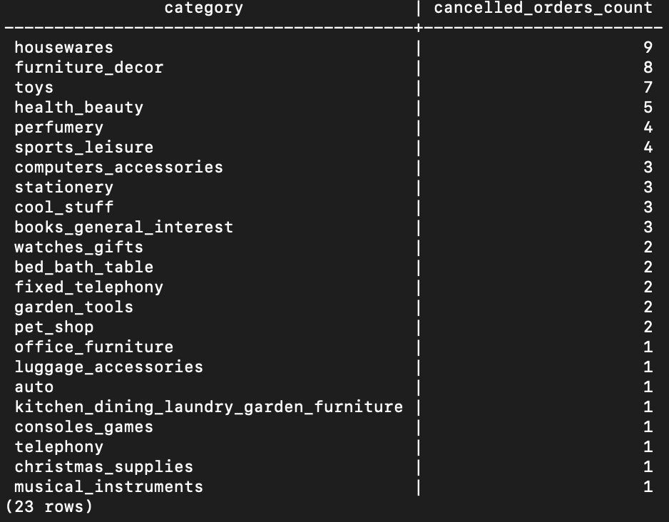
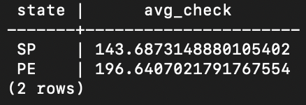
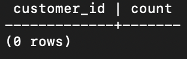

# db_laba

## Коррекность варианта:
Тильга Павел, Б05-308, тг - @qkqkkkkk \
Вариант = ([Номер первой буквы фамилии] + [Номер первой буквы имени] + [Номер второй буквы логина Telegram]) mod 7 + 1 \
Вариант = ([Номер буквы 't'] + [Номер буквы 'p'] + [Номер буквы 'k'] mod 7 + 1 \
Вариант = (20 + 16 + 11) mod 7 + 1 = 47 mod 7 + 1 = 5 + 1 = 6 \
Вариант 6.

## Инициализация и импорт данных датасета.
Создадим все отношения, добавив логичные ограничения, и свяжем их внешними ключами. [Инициализация.](init.sql) \
Заполним все таблицы импортом всех .csv файлов с помощью команды: \
"\copy table from 'path_to_table' delimiter ',' csv header;"

## Пункт 1 (Анализ распределения товаров (электроника, мебель, игрушки) по месяцам в Белу-Оризонти).
Соединим таблицы: \
orders (для получения дат заказов и customer_id) \
customers (для фильтрации по городу Белу-Оризонти) \
order_items (для информации о товарах) \
products (для категорий товаров) 

SQl запрос написан здесь: [1 запрос](requets.sql) 

Получим вот такой вывод:  

Отсюда видно, что электроника всегда закупалась мало, не считая небольшого повышения в районе января 2018 года. Мебель закупалась более менее стабильно, если не считать несколько плохих месяцев. А вот игрушки резко получили свой пик продаваемости в последнем квартале 2017 года. Заметим, что небольшой пик продаваемости электроники начался следом за пиком продаваемости игрушек. Возможно, большинство людей захотело все самое новое и свежее забрать с собой именно в 2018 год :)

## Пункт 2 (Категории товаров отмененных заказов в Рио-де-Жанейро).
Соединим таблицы: \
orders (статус заказа) \
customers (фильтр по штату) \
order_items (информация о товарах) \
products (категории товаров)

SQl запрос написан здесь: [2 запрос](requets.sql) 

Получим вот такой вывод:  

## Пункт 3 (Средний чек клиента для штатов Сан-Паулу и Пернамбуку).
Соединим таблицы:  \
orders (информация о заказах) \
customers (фильтр по штатам) \
order_payments (стоимость заказов)

SQl запрос написан здесь: [3 запрос](requets.sql) 

Получим вот такой вывод:  

## Пункт 4 (Доля пользователей с повторным заказом в течение 30 дней).
Для начала проверим существуют ли вообще повторные заказы.

Для этого напишем вот такой SQl запрос: [4 запрос](requets.sql) 

Получим вот такой вывод:  

Видно, что пользователей с повторными заказами просто нет, а значит их доля от всего числа пользователей - 0%.

